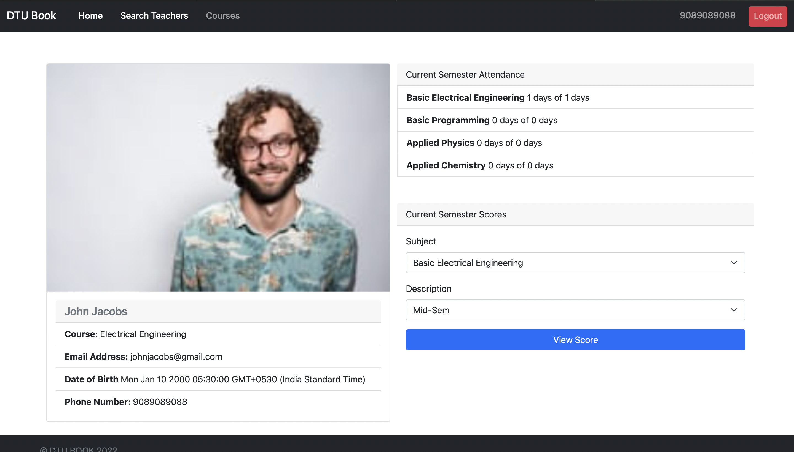

# DTU Book
* DTU Book is a minimal one-stop solution for students and teachers. It simplifies the process of registration of students, attendance records and publishing scores.
* Allows the admin to register students and teachers without any hassle.
* Includes CRUD functionality for attendance and score records. Developed using **MongoDB**, **Express** and **NodeJS** with authentication using **PassportJS**.
* The styling has been done using **Bootstrap**.

## Screenshots
###### Home Page

###### Student Profile

